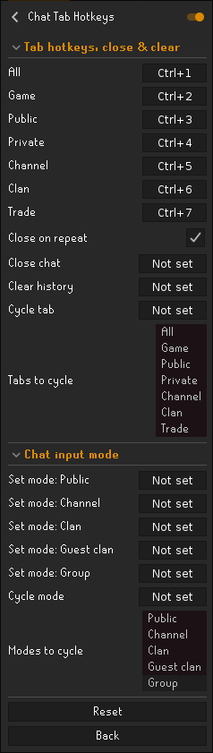

# Chat Tab Hotkeys

Keyboard control for the chat tabs. Switch tab, clear its history, and open or close the chatbox
without reaching for the mouse. No automation and no overlays — everything is client-side and
packet-free (nothing is sent to the game server).

## Keys

- **Tab keys**: one per chat tab (All, Game, Public, Private, Channel, Clan, Trade), bound to
  **Ctrl+1** to **Ctrl+7** by default. Press a tab's key to show it, then press it again to close the
  chat. The "press again to close" behaviour can be turned off.
- **Cycle tab**: steps through the chat tabs one key press at a time, wrapping around. A "Tabs to
  cycle" list in the settings picks which tabs it steps through (all of them by default), so you can
  cycle just Public, Channel and Clan if that is all you use.
- **Close chat**: toggles the chatbox and reopens to the last tab. Works in resizable mode only.
- **Clear history**: clears the current tab's messages. It does this directly, so no other plugin is
  needed. Works on the Public, Private, Channel, Clan and Trade tabs; it does nothing on Game or All.
- **Chat input mode**: sets which channel you type into (Public, Channel, Clan, Guest clan, Group),
  the same as the right-click "Set chat mode" on the All tab. Group only works while you are in a group
  ironman group. A **Cycle mode** key steps through a "Modes to cycle" list (Public, Channel, Clan and
  Guest clan by default; Group is left out because the game resets it when you are not in a group).

Only the tab keys are bound out of the box. Bind the rest in the settings if you want them.

## Settings

There are two groups. The first holds the tab keys, close on repeat, close chat, clear history, the
Cycle tab key and its "Tabs to cycle" list; the second holds the chat input modes, the Cycle mode key
and its "Modes to cycle" list. The two "to cycle" settings are drop-down lists you pick from. The
Ctrl+number defaults are safe to leave on, since modifier combos do not leak into a chat message.

## Notes

- The current tab and open or closed state are read from the game, so the keys stay correct after you
  click tabs with the mouse.
- The keys stay active even while you are typing in the chat. The `Ctrl+1..7` defaults don't leak into
  a message, so this is a non-issue; if you rebind to plain keys, prefer modifier or function keys.
- Closing the chat only works in resizable mode. In fixed mode that action does nothing, while tab
  switching and clear history still work.
- Clear history only applies to the tabs that offer it, which does not include Game or All.
- If you also run the Chat History plugin with *retain chat history* on, a tab you clear with this
  plugin can reappear after a world hop or relog.

## License

BSD 2-Clause. See [LICENSE](LICENSE).
